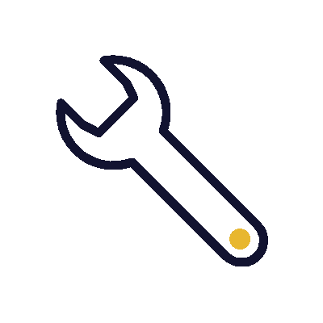

# Hello World! 

I'm Elena Sacramento, I consider myself a very friendly person, who loves to work in a team and who loves to challenge herself. 
- 👩‍💻 I love web development, especially the frontend part, but I have no objection to try the backend part as well. 
- 🎮 I also like videogame development and virtual reality.
- 🚩 I'm currently a fullstack student at [EOI](https://www.eoi.es/es/cursos/26671/curso-de-programacion-fullstack-santa-cruz-de-tenerife)
- 🏆 I've just finished my computer's science degree at University of La Laguna 
- 😊Pronouns: She/Her

  
  

## We can meet at...

  
   

  

## If you want, you could take a look at my statistics...

  
     

## These are some technologies I have worked with 

  
  
  
  
  
  
  
  
  
   
  
  
  
  
  

